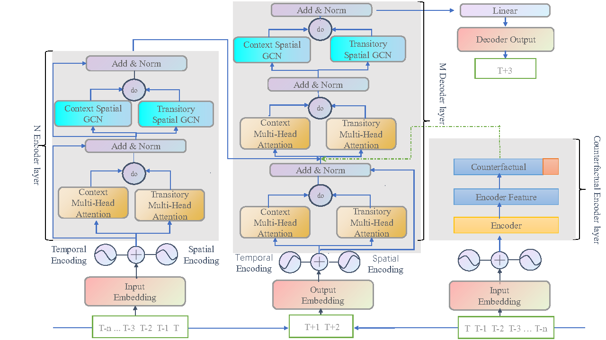

# DeSTGNN 

This is a Pytorch implementation of Deconfounded Spatio-temporal Graph Neural Network for
Multivariate Time Series Forecasting (DeSTGNN) . 



# Datasets

Step 1: Download PEMS04 and PEMS08 datasets provided by [ASTGNN](https://github.com/guoshnBJTU/ASTGNN/tree/main/data). 

Step 2: Process dataset

We take the commands on PEMS04 for example.

Step 1: Process dataset:

- for DeSTGNN 

```python
python prepareData.py --config configurations/PEMS04.conf
```

- for DeSTGNN (p)

```python
python prepareData.py --config configurations/PEMS04_rdw.conf
```
# Train and Test

 train and test the model:

- for DeSTGNN 

```python
nohup python -u train_DeSTGNN .py --config configurations/PEMS03.conf --cuda=0 > "pems03_$(date +%Y%m%d%H%M%S).out"  &
```

```python
nohup python -u train_DeSTGNN .py --config configurations/PEMS04.conf --cuda=1 > "pems04_$(date +%Y%m%d%H%M%S).out"  &
```

```python
nohup python -u train_DeSTGNN .py --config configurations/PEMS07.conf --cuda=2 > "pems07_$(date +%Y%m%d%H%M%S).out"  &
```

```python
nohup python -u train_DeSTGNN .py --config configurations/PEMS08.conf --cuda=2 > "pems08_$(date +%Y%m%d%H%M%S).out" &
```

- for DeSTGNN (p)

```python
nohup python -u train_DeSTGNN .py --config configurations/PEMS03_rdw.conf --cuda=1 > "pems03_$(date +%Y%m%d%H%M%S)_rdw.out"  &
```
```python
nohup python -u train_DeSTGNN .py --config configurations/PEMS04_rdw.conf --cuda=2 > "pems04_$(date +%Y%m%d%H%M%S)_rdw.out"  &

```
```python
nohup python -u train_DeSTGNN .py --config configurations/PEMS07_rdw.conf --cuda=1 > "pems07_$(date +%Y%m%d%H%M%S)_rdw.out"  &
```
```python
nohup python -u train_DeSTGNN .py --config configurations/PEMS08_rdw.conf --cuda=1 > "pems08_$(date +%Y%m%d%H%M%S)_rdw.out"  &
```

We would like to express our gratitude for the code provided in [ASTGNN](https://github.com/guoshnBJTU/ASTGNN/). 